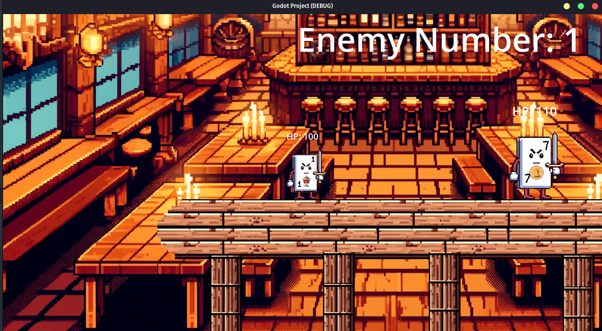

# AniTruco

AniTruco is a game where cards from the brazilian Truco card game come to life. The story revolves around a weak card that seeks to defeat its enemies and become increasingly stronger.

## Table of Contents
- [Character Development](#character-development)
- [Project Systems](#project-systems)
- [Final Project Images](#final-project-images)

## Character Development
All characters implemented in this project are based on the Spanish Truco deck. The main character starts as a 4 of clubs at the beginning of the first stage but changes as the game progresses, taking on the appearance of higher power cards when victorious in combat.

- **Main Character:** A low-value card that believes it is too weak to defeat its opponents.
- **Enemies:** Cards of increasing value and different suits, becoming stronger as the player progresses through the stages.
- **Bosses:** There are four boss battles, including the 7 of diamonds, 7 of spades, 1 of clubs, and the final boss, 1 of spades.

### Graphic Definition
The project uses Pixel Art style for characters, aiming for a 2D platform experience. The Aseprite tool was used for editing and animations. The enemies' sprites are based on the main character's sprites, changing only the suits and values.

## Project Systems
### Attack System and Health Counter
The attack system involves collision boxes where both enemy and protagonist nodes belong to the same group named "Hit." A function computes the damage when an attack collision occurs, altering the character's health variable.

The health system uses groups to connect the protagonist, enemies, and on-screen health indicator, with conditions to remove characters when their health reaches zero.

### Enemy Counter and Portals
The enemy counter updates a variable each time an entity is spawned or defeated. A portal node, activated when all enemies are defeated, redirects the player to the boss room.

### Dynamic Weather System with Rain
The rain system includes a 2D node connected to a script running random timers, creating a dynamic weather effect. The protagonist's speed reduces during rain to simulate the wet condition.

### Sprite Swap and Power-ups
To represent the character's evolution, the protagonist takes on the identity of defeated enemies. A system of hidden Sprite2D nodes within the main character's scene enables animation changes upon defeating an enemy, also updating damage and health.

### Attack and Pursuit System
To enable enemies to chase the protagonist, a function that interacts with a collision format was used. When the main character is detected within this collision, a function activates, gradually changing the enemy's position towards the final destination, stopping if the character is no longer detected.

## Final Project Images
Below are images of the final project showcasing various systems and sprites in action.

